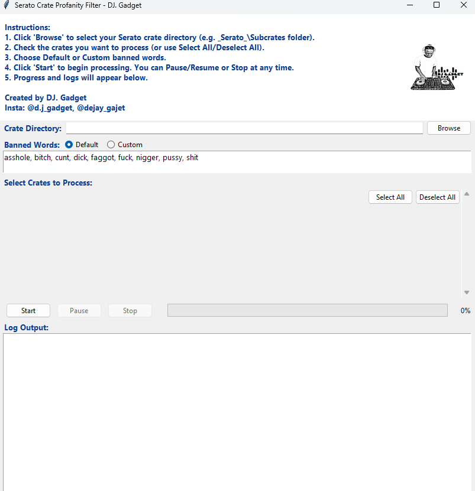

# Serato Crate Profanity Filter

A GUI tool for DJs to scan Serato crate files for profane songs using Spotify and Genius APIs, and create a new "clean" crate.

---

## Features

- GUI: Easy-to-use interface (Tkinter)
- Profanity detection: Uses profanityfilter (supports custom words and multiple languages)
- Spotify API: Looks up song/artist info (uses two accounts, switches if rate-limited)
- Genius API: Fetches lyrics for profanity check
- Serato crate support: Reads/writes .crate files (requires serato_crate Python package)
- Caching: Avoids duplicate API calls for faster processing
- Offline Mode: If Spotify is unavailable, the app will use only file names for lyric search (see "Offline Mode" below)

---

## Requirements

- Python 3.8+
- The following Python packages:
  - tkinter (comes with Python)
  - spotipy
  - lyricsgenius
  - profanityfilter
  - mutagen
  - Pillow
  - serato_crate (your local folder or pip package)

### Install all dependencies with:
```shell
pip install spotipy lyricsgenius profanityfilter mutagen pillow serato_crate
```


## Quick Start
Clone this repository:
```shell

git clone https://github.com/EnockAsante/Serato-Crate-Profanity-Filter.git
cd Serato-Crate-Profanity-Filter

```

(Optional)
- Open sort_profanity_windows_gui.py in a text editor.
- Set your Genius and Spotify API credentials (see below).

## Run the app:
```shell
python sort_profanity_windows_gui.py
```


## How to Change API Tokens
```
GENIUS_ACCESS_TOKEN = "YOUR_GENIUS_TOKEN"
Get a token at: https://genius.com/api-clients

Spotify Tokens
Edit the SPOTIPY_CLIENTS list in the script:

SPOTIPY_CLIENTS = [
{'client_id': 'YOUR_FIRST_CLIENT_ID', 'client_secret': 'YOUR_FIRST_CLIENT_SECRET'},
{'client_id': 'YOUR_SECOND_CLIENT_ID', 'client_secret': 'YOUR_SECOND_CLIENT_SECRET'}
]

Get tokens at: https://developer.spotify.com/dashboard/applications
Tip: You can use just one Spotify account if you want, but two helps avoid rate limits.
```

## Usage as a Windows EXE
Build with PyInstaller:
```shell
pyinstaller --noconfirm --onefile --windowed --add-data "dj_gadget_logo.png;." --add-data "serato_crate;serato_crate/" sort_profanity_windows_gui.py
Run the generated dist/sort_profanity_windows_gui.exe.

```

## Offline Mode

If both Spotify accounts fail to initialize (e.g., no internet or API issues), the app will:
- Inform you with a popup:
  "Spotify API unavailable. Switching to offline mode. Only file names will be used for lyric search."
- In this mode, the app will skip all Spotify lookups and use the file name (parsed as best as possible) for Genius lyric search.
- This allows you to still check for profanity using only the information in your file names.

## What’s Left for the User

- Set your own Genius and Spotify API credentials (see above).
- If you want to use your own banned words, use the "Custom" option in the GUI.
- If you want to add more language support, see the profanityfilter docs.

## Notes

- If you get rate-limited by Spotify, the app will automatically switch accounts or wait as needed.
- If both Spotify accounts fail, the app will switch to offline mode and use only file names for lyric search.
- All API results are cached for speed and to avoid hitting rate limits.
- The app works on Windows and Mac (build on each OS for native executables).
- If you update the code, rebuild the .exe with PyInstaller.

## Contributing

Pull requests are welcome! For major changes, please open an issue first to discuss what you would like to change.

## License
MIT

## Credits
- Created by DJ. Gadget
- Instagram: @d.j_gadget | @dejay_gajet

